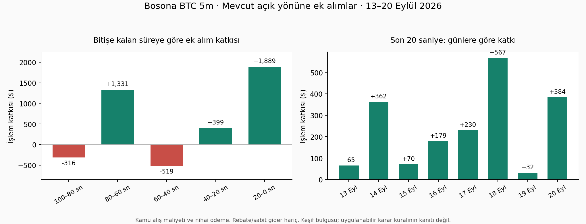

# Bosona: geç ek alımların neden kazandığını araştırma

**En güçlü bulgu, kapanışa yaklaşırken doğru fiyatı seçmek. Bosona'nın tam karar
kuralı çözülmüş değil.** Ucuz kalan ve kısa vadede toparlanma işareti gösteren taraf,
ileri araştırmada ilk sıraya alınacak aday. Bu rapordaki bütün yeni strateji sonuçları
sanaldır; gerçek emir verilmedi, LIVE stratejisi veya bütçesi değiştirilmedi.

## 1. Önceki incelemeye ne eklendi?

13 Eylül 00:00–20 Eylül 22:30 UTC dönemindeki **1.842 Bosona piyasası / 19.761 alım**
korundu. Ayrıca Bosona'nın işlemi bulunmayan sözleşmeler dahil **2.286 BTC5m sözleşmesi**
için karşılaştırma evreni kuruldu. Eski **124 saat / 18,65 GB** ham kayıt tarandı.
643.059 nedensel defter kesiti çıkarıldı; 19–20 Eylül veritabanındaki 339 pencere
için de yeni kesitler üretildi. Bozuk 18 Eylül 22 UTC dosyasının tamamı dışarıda.
Defterin yeniden oluşturulan en iyi fiyatı, mesajın bildirdiği fiyatla uyuşmadığında
yeni tam defter gelene kadar kesit kullanılmadı. 494.827 böyle olay, 214.362 eksik
örnekleme noktası var; bunlar işlem veya bağımsız piyasa sayısı değildir.

Son 100 saniyedeki 6.242 dolumun **4.428'inde defter**, **4.234'ünde kapanış modeli
girdileri**, **4.331'inde borsa işlem zamanına eşleme** var. Eksik veri sıfır işlem
sayılmadı. Eski saatlerden Chainlink verisi de kurtarıldı. Piyasa başlangıç referansı
ile kayıtlı referans arasında uyuşmazlık yok. 60 metrik incelendi: fiyat/süre/boy;
ilk giriş ve önceki envanter; maliyet, risk tabanı ve tekrar sayısı; 10/30/60 saniye
hareket; 1/5/15 dakika hareket; oynaklık ve fiyat aralığı; RSI14, hacim ve alım
baskısı; spread, derinlik ve dengesizlik; Binance spot/vadeli fiyat farkları;
TWAP kapanış tahmini ve ödenen/istenen fiyat arasındaki farklar.

Bu geniş tarama **keşiftir**. 13–17 Eylül keşif, 18–20 Eylül kronolojik kontrol
olarak ayrıldı; daha önce incelenmiş günler olduğundan kör test değildir.
Metrik kovaları ilk dönemin çeyrekliklerinden üretildi; tüm kovalar, başarısızlar
dahil `screen.json` içinde. Fiyat/boy ve işlem sonrası risk gibi dolum özellikleri,
karar anında kullanılabilir sinyallerle karıştırılmadı. Sanal politikalarda yalnız
karar öncesi piyasa verisi kullanıldı.

## 2. En belirgin bulgu: son 20 saniye

Mevcut açık yönü artıran son 20 saniye alımları: **271 kayıt / 66 pencere,
+1.888,81 USD**. Sekiz günün her birinin gerçek miktarlı toplamı pozitif.
En iyi üç pencere çıkarılınca **+975,73 USD** kalıyor.

- Her dolum kaydı eşit beş pay olsaydı: **+185,69 USD**; en iyi üç pencere hariç
  **+55,52 USD**. Bu normalizasyon, parçalı emir kayıtlarının sayısından etkilenir.
- Her pencerenin toplam ek alımını beş paya indirince: **+27,26 USD**; en iyi üç
  pencere hariç **+15,08 USD**. Bu kez sekiz günün yedisi pozitif; 19 Eylül negatiftir.
- Aynı saniyede sıra belirsizliği olan pencereler çıkarılınca: **+1.741,01 USD**.
- Gerçek borsa saatiyle son 20 saniyeye düşen eşlenmiş 157 kayıt / 40 pencere:
  **+1.190,61 USD**, en iyi üç pencere hariç **+460,42 USD**. Kapsanan yedi gün
  pozitif; eşleme olmayan 19 Eylül'e sıfır sonuç yazılmadı.
- Sınır 30, 25, 15 veya 10 saniye yapıldığında da gerçek miktarlı günlük toplamlar
  pozitif. Bunlar büyük ölçüde aynı işlemler olduğu için bağımsız doğrulamalar değildir.

**Nasıl para getiriyor?** Son 20 saniyede 30 cent altında alınan ek miktarın ortalama
nakit maliyeti **12,8 cent**, nihai ortalama ödemesi **36,9 cent/pay**.
Bu grup **+912,79 USD** katkı veriyor; en iyi üç penceresi çıkarılınca **+253,73 USD**.
Payların çoğunun kaybetmesiyle toplam kazanç bir arada mümkün: kazanan miktar,
ödenen ucuz fiyatı fazlasıyla karşılamış. Bu, herhangi bir ucuz alımın avantajlı
olduğu veya gelecekte aynı ödeme oranının korunacağı anlamına gelmez.

Kapanış öncesi defteri bulunan alt grupta favori olmayan tarafa eklemeler
+1.061,68 USD, favori tarafa eklemeler +575,74 USD katkı veriyor. Bu ayrım,
dolum fiyatını favori sanmak yerine dolumdan önceki gerçek defterle yapıldı.
Kamu zamanından beş saniye önceki bağlam, Bosona'nın emir verdiği kesin an değildir.

Bu kazanç yalnız kilitlenmiş kârın harcanması da değil: son 20 saniye eklemelerinin
196'sından önce en kötü sonuç tabanı zaten negatif; bunların katkısı +1.594,66 USD.
Bosona gerçekten yön riski taşıyor.

## 3. Gecikme ve fiyat seçimi kazancı değiştirebiliyor

Kamu işlem zamanı, eşlenen örnekte borsa zamanından medyanda **2,74 saniye** sonra
geliyor; yüzde 10–90 aralığı yaklaşık **1,97–3,61 saniye**.

Son 100 saniye eklemelerinde, aynı ölçülebilen 2.532 kaydı beşer paya indirince:
Bosona'nın fiyatıyla **+53,24 USD**; kamu zamanından beş saniye sonra satış
defterinden alım ve ücretle **−217,02 USD**. Bu, gerçek API bildirimini alıp
kopyalayan bot testi değildir; sabit gecikmeli fiyat karşılaştırmasıdır.

Son 20 saniye alt grubunda aynı yöntem, ölçülebilen 104 kayıtta **+75,06 → +21,83 USD**
değişimi veriyor. Gecikmeli sonuçtan en iyi üç pencere çıkarılınca **−10,08 USD**.
Ufuk değişince kapsanan kayıtlar değişir; farklı ufukların toplamları doğrudan kıyaslanmaz.
Alış sırasını veya iptalleri bildiğimiz iddia edilmiyor; gerçekleşmiş fiyatın önemi görülüyor.

## 4. Hangi açıklamalar güçlendi, hangileri zayıfladı?

- Son kapalı dakikadaki hareket ve alım baskısı, bazı dolum alt gruplarında iki
  dönemde de olumlu. Ancak bunları doğrudan alım kuralına çevirmek genel bir
  iyileşme üretmedi. Dolumlara koşullu ilişki, uygulanabilir strateji değildir.
- “Düştükçe ekle”, yalnız favori, yalnız yüksek hacim veya yalnız büyük boy gibi
  tek değişkenli açıklamalar yeterli değil. Bütün olumlu kovalar raporlandı;
  yalnız kazanan kovalar seçilerek başarı hesabı yapılmadı.
- Kapanışın son 60 saniyelik ortalamasını hesaplamak anlamlı bir mekanizma.
  1.588 pencerede, kaydedilen spot fiyatlardan kurulan ortalama ile resmî kapanışın
  hata RMS'i yaklaşık **0,42 USD/BTC**; yön etiketi dört pencerede farklı.
  Bu, özellikle referansa çok yakın kapanışlarda kesin sonuç hesabı değildir.
- Son 10 saniye hareketini aynen sürdürmek aşırı iddialı çıktı: örneğin t=240'ta
  sonraki dönem kapanış fiyatı RMS hatası statik modelde **21,21 USD**, tam hareket
  uzatımında **43,94 USD**. İlk dönemden öğrenilen hareket katsayısı yaklaşık **0,127**.
  Tahmin hataları kısa dönem normal dağılım varsayımından daha büyük; aşırı kesin
  olasılıkları kârlı görünen birkaç işlemle doğrulanmış saymıyoruz.

## 5. Gerçekleştirilebilir fiyatla sanal karşılaştırma

Her uygun sözleşmede t=210/240/270/280/290 ayrı deney; en fazla bir alım ve beş pay.
Karar defterinden en az 250 ms sonraki satış derinliği kullanıldı. Ücretler piyasanın
kendi tarifesiyle; rebate/sabit gider yok. Fiyat değdi diye maker dolumu yazılmadı.
Sinyalsiz uygun pencere sıfır; eksik defter/fiyat ayrı.

Uygun pencere sayıları sırasıyla **1.222 / 804 / 266 / 140 / 58**. Bunlar ayrı zaman
deneyleridir, toplamları bağımsız pencere sayısı değildir. Kapanışa yakın iki tarafta
da taze, geçerli alış/satış defteri şartı örneği ciddi biçimde küçültüyor. Dolayısıyla
bütün 2.286 sözleşmede çalışmış bir bot sonucu veya toplam fırsat sayısı iddia edilmiyor.

| Kural | t=240 toplam $ | t=280 toplam $ | t=280 sonraki dönem $ | t=280 seçim |
|---|---:|---:|---:|---:|
| Favori | -80.33 | -19.21 | -20.13 | 140 |
| Kapanış ortalaması, sabit fiyat | -20.09 | -6.74 | -2.32 | 75 |
| Kapanış ortalaması + tam hareket | +27.08 | +30.01 | +7.07 | 94 |
| İlk dönemden öğrenilen hareket ve hata ölçeği | -6.89 | +6.31 | +8.27 | 105 |
| İlk dönem hata dağılımıyla olasılık | -31.78 | -7.96 | -7.56 | 80 |
| Spot yönü/uzaklığıyla değer | -7.98 | +20.46 | +20.51 | 110 |
| Ucuz tarafta dönüş (RSI + 10 sn) | +21.74 | +19.93 | +11.21 | 23 |
| Dönüş + piyasa fiyatı henüz yükselmemiş | +18.64 | +9.98 | +4.11 | 17 |
| Ucuz taraf + son kapalı dakika dönüşü | -28.66 | +1.09 | +3.92 | 55 |
| Dakika dönüşü + alım baskısı | -3.48 | +2.59 | +0.34 | 13 |

Öne çıkan **ucuz tarafta dönüş** kuralı: o an daha ucuz tarafın satış fiyatı <0,50;
o tarafa göre son 14 kapalı dakikanın basit RSI'ı <40; son 10 saniyedeki BTC
hareketi o yönü destekliyor. Birincil aday giriş zamanı **t=280**.

Bu aday 140 uygun pencerenin **23'ünde** alım seçti: **+19,93 USD**, en iyi üç
pencere hariç **+7,47 USD**. İlk dönem +8,72, sonraki dönem +11,21 USD.
23 seçimin yalnız yedisi kazanıyor; ücret dahil ortalama maliyet **13,1 cent/pay**.
Sonuçlanmış işlemler sırasıyla hesaplanan en büyük düşüş **2,39 USD**.
Bu, zarar kes içeren canlı sonuç değildir; sanal deneylerde 10 dolarlık kesici uygulanmadı.

Pencere bootstrap %95 aralığı **[+1,79, +40,09]**, gün bootstrap aralığı
**[+2,07, +42,60] USD**. **Bu aralıklar geniş taramada aday seçilmiş olmasını
düzeltmiyor.** On kural × beş zaman karşılaştırmasından sonra seçilen, yalnız
23 işlemlik sonuç kârlı bot kanıtı değildir. Sonraki dönem kazancının 10,73 doları
18 Eylül'de; keşif döneminin en iyi üç penceresi çıkarılınca sonuç negatife dönüyor.
İki dönemin ayrı ayrı güçlü doğrulanması henüz yok.

Kural, Bosona'nın bütün girişlerini, ekleme miktarlarını ve işlem hızını yeniden
üretmiyor. Burada bulunmuş olan, ayrıca sınanabilecek dar bir fiyat/zaman hipotezi.

## 6. Sabit ileri kontrol ve doğrulama

Yeni aday için **21 Eylül 00:30–24 Eylül 00:30 UTC** (Türkiye 03:30–03:30)
aralığı, kaynak hash'i ve kurallar `prospective_protocol.json` içinde sabitlendi.
Bu dosya yeni karar botu başlatmaz; mevcut kamu defteri ve Chainlink kaydedicilerinin
üreteceği veriyle yapılacak ileri kontrolü tanımlar. Asıl kaynakta defter ve iki fiyat
akışının güncelliği doğrulandı; repo kopyası dönemsel senkron nedeniyle geriden gelebilir.
Mevcut üç kurallı Londra gölgesi bu araştırmada değiştirilmedi.

Başarı için en az üç gün, 100 uygun pencere **ve 100 seçilen işlem**, iki kümeli
alt güven sınırının pozitifliği, en iyi üç pencere hariç pozitiflik aranacak.
72 saat sonunda işlem sayısı yetmezse sonuç yetersiz sayılacak; bu sürede eşikler
sonuca bakarak değiştirilmeyecek. İlk kontrol fiyat/fırsat seçimini sınar;
canlı emir yürütme, boy artırma veya aylık gelir çıkarımı bu aşamanın sonucu değildir.

Üç seçilmiş kazanç/kayıp piyasası kamu `/trades` yanıtıyla yeniden doğrulandı:
miktar ve brüt sonuçlar aynı. Üç farklı gündeki 18 defter kesiti, ham mesajların
bildirdiği en iyi fiyatlarla bağımsız olarak eşleşti. Gelecek fiyatın geçmiş sinyali
değiştirmemesi, kapalı mum gecikmesi, yetersiz derinlik, bayatlık ve ücret kontrolleri
geçti. Bellek iyileştirmesi öncesi/sonrası özellik ve politika kayıtlarının hash'leri
aynı kaldı. Python derleme ve hedefli Ruff kontrolü geçti.

Kod: `analiz/izleme/bosona_derin.py`. Tekrar çalıştırma sırası:
`check`, `fetch`, `extract`, `recover_prices`, `new_books`, `new_times`,
`forecast`, `screen`, `policy`, `mechanism`, `verify_quotes`.

Kanıtlar `data/analysis/bosona_derin_20260921/` altında:
`features.json`, `screen.json` (60 metriğin bütün kovaları), `mechanism.json`,
`policy.json`, `policy_rows.json`, `forecast.json`, `statistics.json`,
`coverage.json`, `quote_validation.json`, `case_api_validation.json`,
`twap_reconstruction_check.json`, `prospective_protocol.json`.

Kullanılan resmî tanımlar:
[Chainlink TWAP](https://docs.polymarket.com/market-data/chainlink-twap),
[Polymarket ücretleri](https://docs.polymarket.com/trading/fees),
[Binance piyasa verisi ve mumlar](https://developers.binance.com/en/docs/catalog/core-trading-spot-trading/api/rest-api/market).
RSI, Wilder düzeltmesi yerine son 14 değişimin basit toplamından hesaplandı.
Geçmiş Binance mumları yalnız kapanış +2 saniyeden sonra kullanıldı; bu varsayım,
her tarihsel mumun bizim bağlantımıza iki saniyede ulaştığının kayıtlı kanıtı değildir.

Araştırma kaynak SHA-256: `b825c37449e1069c8bcedfa4037d6dd9ee620bdd667da1e4d6b36905fb1a0690`.

## Sonraki operatör talebi: ayrı Londra shadow'u açıldı

21 Eylül **00:46:37 UTC**'de `bosona-rebound-shadow` başlatıldı.
Atanmış pencereler **21 Eylül 00:50–24 Eylül 00:50 UTC**; Türkiye saatiyle
**03:50–03:50**, toplam 72 saat. Ardından sonuçlar için en fazla 25 dakika
bekler. Önceki 00:30 ileri veri protokolü ayrı kalır; bu yazıcının başlangıcı
geriye çekilmedi. İlk planlı karar 00:54:00, birincil karar 00:54:40 UTC.
Başlangıç doğrulaması sırasında henüz planlı işlem veya PnL yoktu.

Ana kural t=280'de ucuz taraf ask<0,50, kendi yönünde basit RSI14<40 ve
son 10 saniyelik momentum>0. Pencere başına 5 sanal pay; gerçek emir yok.
t=240/270 ikincil ölçümleri ve aynı penceredeki favori karşılaştırması ayrı
sanal stratejiler olarak kaydedilir, tek bir portföyün PnL'si gibi toplanmaz.
Yeni kuralın sonuçları mevcut üç kurallı gölgeye karışmaz.

İlk **zaman dışı gerçek veri kontrolünde** defter HTTP süresi 25 ms idi;
RSI14=49,49 ve rebound sinyali yoktu. Bu kontrol deney örneklemine katılmadı.
Karar, veri alımı ve sanal uygulama zamanları ayrı kaydedilir. Karardan
en az 250 ms sonra yeni defter istenir; 5 payın derinliği ve piyasanın
ücreti hesaba katılır. Bu, gerçek dolum ölçümü değildir. Eksik veri ve
işlem seçmeyen geçerli pencere ayrı tutulur. Kapanmadan alınmış mum
sonradan kapalı mum kabul edilmez; alış yanıtı ve kapanış+2sn birlikte aranır.

Londra dizini: `/home/ubuntu/polymarket-bosona-rebound/data/forward/`.
`watch_manifest.json` dört kaynak dosyasını sabitler; `shadow.jsonl`
girdi/karar/sanal uygulama/sonuç kayıtlarını tutar. Yeniden başlatmak aynı
manifesti ve karar geçmişini kullanır; bütçe açmaz veya dönemi sıfırlamaz.
Bu dizindeki `STOP_SHADOW` yalnız yeni gölgeyi durdurur. Oturum:
`tmux attach -t bosona-rebound-shadow`.

Yerel ve Londra öz-testleri, hedefli Ruff/derleme geçti. Kilit, değişmiş
kaynağın reddi, kapalı mum, eşik sınırları, ücret ve sıfır sinyal doğrulandı.
Kontrollü sonlu döngüde 240/270/280 kayıtları ve sonuçları üretildi;
yeniden başlatmada karar/uygulama/sonuç yinelenmedi. Londra'da iki ayrı
sürecin güncel kalp atışı ve mevcut gölgenin değişmeyen kaynak hash'i görüldü.

Yeni yazıcı SHA-256:
`19b115c07016d5a950c0dead78c84c46287b68002ac5805a7d850734763fd5e5`.
Donmuş dört dosya, manifest, zaman dışı smoke ve çalışma kanıtı:
`data/analysis/bosona_derin_20260921/rebound_release/`.
Ek döngü kontrolü: `rebound_loop_validation.json`.
